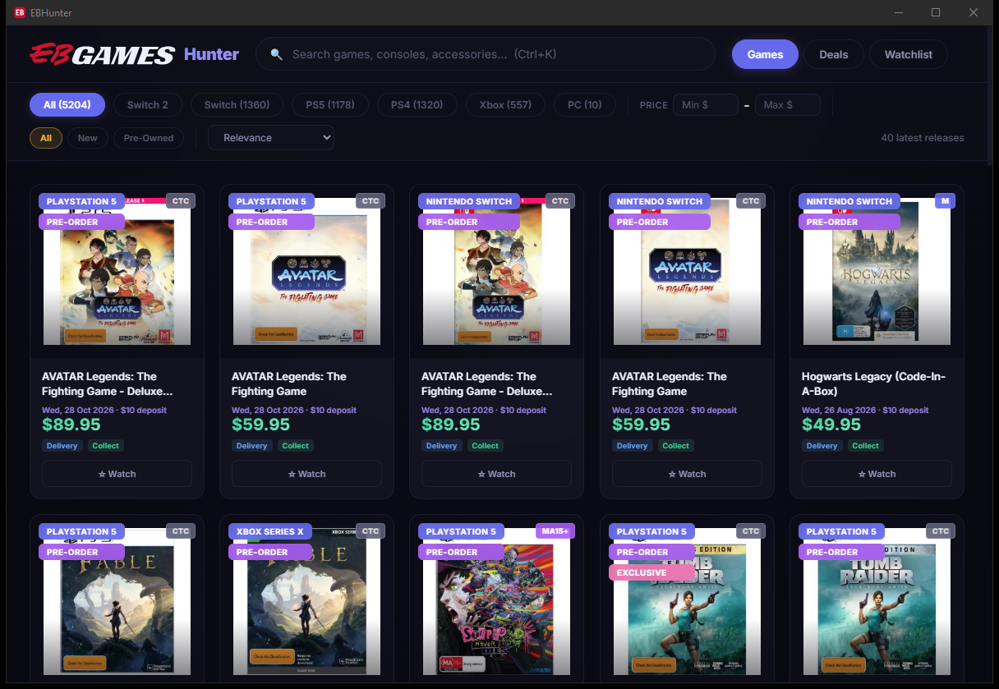

# EBHunter

**Browse, search, and track prices across all Australian EB Games stores — all from one clean desktop app.**

---

## Download

Grab the right file for your computer from the **[Latest Release](https://github.com/NookieAI/EBHunter/releases/latest)** page:

| Your computer | Download |
|---|---|
| **Windows 10/11** | `EBHunter.exe` — *portable, just double-click* |
| **Mac (Apple Silicon — M1/M2/M3/M4)** | `EBHunter_aarch64.app.zip` |
| **Mac (Intel)** | `EBHunter_x64.app.zip` |
| **Linux (64-bit x86)** | `EBHunter_amd64.AppImage` |
| **Android** | `EBHunter.apk` — *sideload on any Android phone* |

*Not sure which Mac you have? Apple menu > About This Mac. "Chip: Apple M1/M2/M3/M4" = Apple Silicon. "Processor: Intel" = Intel.*

---

## What it does

- **Full Australian catalog** — every game, console, and accessory across all EB Games Australia stores, updated every 12 hours
- **Instant search** — start typing and results filter as you go
- **Filter by platform** — PS5, PS4, Switch, Switch 2, Xbox, PC
- **Price tracking** — see price drops and increases over time
- **Deal finder** — dedicated deals view sorted by biggest savings
- **Watchlist** — track specific games and get notified when prices drop
- **Game details** — full descriptions, screenshots with lightbox viewer, ratings, availability
- **Filter by condition** — new or pre-owned, with price range filters
- **Sort options** — by relevance, price, name, or release date
- **Surprise Me** — feeling lucky? Get a random game from the catalog

---

## How it works

The app ships with a locally cached catalog of every game listed on EB Games Australia. No account or login needed — just open the app and browse. The catalog refreshes automatically every 12 hours. All images and metadata are served from our CDN for fast, reliable loading.

---

## Screenshots

---

## License

This project is provided as-is for personal use.
